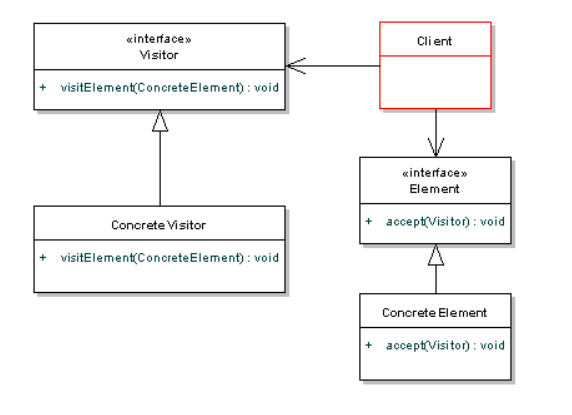

- [Quali sono i pattern comportamentali, quali costruttivi e quali strutturali](#quali-sono-i-pattern-comportamentali-quali-costruttivi-e-quali-strutturali)
- [Domanda su .net assembly (Come funzionano) , metadati](#domanda-su-net-assembly-come-funzionano--metadati)
  - [Il .NET assembly](#il-net-assembly)
  - [I metadati](#i-metadati)
- [Domanda su cls di .net](#domanda-su-cls-di-net)
- [Dire di che tipo deve essere il type di un event](#dire-di-che-tipo-deve-essere-il-type-di-un-event)
- [Pattern FLyWeight](#pattern-flyweight)
- [Pattern che usano la delega](#pattern-che-usano-la-delega)
- [Quale pattern NON usa la composizione e delega](#quale-pattern-non-usa-la-composizione-e-delega)
- [Domanda sui rischi tecnologici](#domanda-sui-rischi-tecnologici)
  - [Analisi e gestione dei rischi](#analisi-e-gestione-dei-rischi)
- [Definizione di design pattern](#definizione-di-design-pattern)
- [Scopo del modello evolutivo](#scopo-del-modello-evolutivo)
  - [Modelli evolutivi](#modelli-evolutivi)
    - [Programmazione esplorativa](#programmazione-esplorativa)
    - [Applicabilità](#applicabilit%C3%A0)
    - [Problemi dei modelli evolutivi](#problemi-dei-modelli-evolutivi)
- [Domanda su tipi valore e tipi riferimento](#domanda-su-tipi-valore-e-tipi-riferimento)
  - [CTS - Common Type System](#cts---common-type-system)
    - [Tipi valore](#tipi-valore)
    - [Tipi riferimento](#tipi-riferimento)
- [Domanda su le possibili operazioni che si possono fare su un evento](#domanda-su-le-possibili-operazioni-che-si-possono-fare-su-un-evento)
  - [Riepilogo evento](#riepilogo-evento)
  - [Operazioni su eventi](#operazioni-su-eventi)
    - [Agganciarsi all'evento](#agganciarsi-allevento)
    - [Sganciarsi da un evento](#sganciarsi-da-un-evento)
- [Cosa si intende per fragilità del codice](#cosa-si-intende-per-fragilit%C3%A0-del-codice)
- [Pre e post condizioni nel subclassing](#pre-e-post-condizioni-nel-subclassing)
- [Rigidità del software](#rigidit%C3%A0-del-software)
- [Protected e Internal](#protected-e-internal)
  - [Protected](#protected)
  - [Internal](#internal)
  - [Protected Internal (OR)](#protected-internal-or)
- [Bad Design](#bad-design)
- [Principi premessa](#principi-premessa)
  - [Principio zero - rasoio di occam](#principio-zero---rasoio-di-occam)
  - [SEMPLICITÀ E SEMPLICISMO](#semplicit%C3%A0-e-semplicismo)
  - [DIVIDE ET IMPERA](#divide-et-impera)
  - [MAKE ALL OBJECT DATA PRIVATE](#make-all-object-data-private)
- [OCP - The Open/Closed Principle](#ocp---the-openclosed-principle)
- [LSP - Liskov Substituion Principle](#lsp---liskov-substituion-principle)
  - [Design by Contract](#design-by-contract)
- [Passaggio dei parametri](#passaggio-dei-parametri)
- [WhiteBox and BlackBox Testing](#whitebox-and-blackbox-testing)
  - [Black Box Testing](#black-box-testing)
  - [White Box Testing](#white-box-testing)
- [Capacità di sopravvivenza del sistema](#capacit%C3%A0-di-sopravvivenza-del-sistema)
- [RUP - Rational Unified Process](#rup---rational-unified-process)
  - [PROSPETTIVA DINAMICA](#prospettiva-dinamica)
  - [PROSPETTIVA STATICA](#prospettiva-statica)
  - [PROSPETTIVA PRATICA](#prospettiva-pratica)
- [Attori](#attori)
- [GDPR - General Data Protection Regulation](#gdpr---general-data-protection-regulation)
  - [Pseudonimizzazione](#pseudonimizzazione)
    - [Principi](#principi)
- [Metadati e reflection .NET7](#metadati-e-reflection-net7)
  - [Metadati](#metadati)
  - [Reflection](#reflection)
  - [Custom attributes](#custom-attributes)
- [Meta programmin in .NET](#meta-programmin-in-net)
- [Pattern Observer - Comportamentale](#pattern-observer---comportamentale)
- [Pattern strategy - Comportamentale](#pattern-strategy---comportamentale)
- [Pattern Adapter - Strutturale](#pattern-adapter---strutturale)
- [Pattern Composite - Strutturale](#pattern-composite---strutturale)
- [Pattern Visitor - Comportamentale](#pattern-visitor---comportamentale)
  - [Quando usare il pattern visitor](#quando-usare-il-pattern-visitor)
  - [Limiti del pattern visitor](#limiti-del-pattern-visitor)
- [Pattern State - Comportamentale](#pattern-state---comportamentale)
  - [Conseguenze del pattern](#conseguenze-del-pattern)

# Quali sono i pattern comportamentali, quali costruttivi e quali strutturali


(trucchetto: A-F sono strutturali / G-Z sono comportamentali / Factory e Singleton sono Creazionali)

# Domanda su .net assembly (Come funzionano) , metadati
## Il .NET assembly
-   E' l'unità minima per la distribuzione e il versioning
-   Normalmente è composto da un solo file
-   Può essere composta da più file (Module)


## I metadati
-   Descrrivono l'assembly - Manifest
    -   Identità: nome, versione, cultura
    -   Lista dei file che compongono l'assembly
    -   Riferimenti ad altri assembly da cui si dipende
    -   Permessi necessari per l'esecuzione
-   Descrizione dei tipi contenuti nell'assembly
    -   Nome, visibilità, classe base, interfacce
    -   Campi, metodi, proprietà, eventi
    -   Attributi
        -   Definiti dal compilatore
        -   Definiti dal framework
        -   Definiti dall'utente


# Domanda su cls di .net
Il **Common Language Specification**
-   Definisce le regole di compatibilità tra linguaggi
    -   Regole per gli identificatori
        -   Unicode, case-sensitivity
        -   Keyword
    - Regole per denominazione proprietà ed eventi
    - Regole per costruttori degli oggetti
    - Regole di overload più restrittive
    - Ammesse interfacce multiple con metodi con lo stesso nome
    - Non ammessi puntatori unmanaged


-   Regole
    - Information hiding a livello di assembly
    - Information hiding a livello di classe
    - Information hiding a livello di field
-   Costanti: il nome dovrebbe iniziare con una lettera maiuscola e solitamente deve essere pubblica
-   Field: il nome deve iniziare con ‘_’ seguito da lettera minuscola e deve essere privato
-   Field read-only: une delle due convenzioni precedenti

# Dire di che tipo deve essere il type di un event

# Pattern FLyWeight
Il FlyWeight è un pattern **Strutturale**.
-   Descrive come condividere oggetti *leggeri* in modo tale che il loro uso non sia troppo costoso
-   E' un oggetto condiviso utilizzabile simultaneamente da più clienti.
-   E' svincolato dal contesto in cui opera
-   E' ottenibile soltanto mediante una **FlyweightFactory**

**Stato intrinseco**
-   Non dipende dal contesto di utilizzo e quindi può essere condiviso da tutti i clienti
-   E' memorizzato nel Flyweight

**Stato estrinseco**
-   Dipende dal contesto di utilizzo e quindi non può essere condiviso dai clienti
-   Calcolato dal cliente
-   Viene passato al Flyweight quando viene invocat una sua operazione


# Pattern che usano la delega
-   **Boss-worker** offre una soluzione ***delegate-based*** *callback_relationship*
-   L' ***AlignerBase*** del pattern **Strategy** delega alle sue sottoclassi l'allineamendot delle singole linee
-   Nel pattern **Decorator** quando un oggetto cambia stato, cambia anche comportamento utilizzando un pattern **State** che utilizza un meccanismo di delega, grazie al quale l'oggetto è in grado di comportarsi come se avesse cambiato classe.

# Quale pattern NON usa la composizione e delega
I pattern che utilizzano Adapter e che non utilizzano Composite e Decorator
-   Pattern **Observer** (?)

# Domanda sui rischi tecnologici
## Analisi e gestione dei rischi
-   Analisi completa di tutti i possibili rischi che posso fare fallori o intralciare la realizzazione del sistema
-   Ogni rischio presenta due carratteristiche:
    -   Probabilità che avvenga
    -   Costo

Le tipologie di rischi sono:
-   **Rischi relativi ai requisiti**
-   **Rischi relativi alle risorse umane**
-   **Rischi relativi alla protezione e privacy dei dati**
-   **Rischi tecnologici** :
    -   
-   **Rischi politici**

Strategie risolutive:
-   **Strategia reattiva**
-   **Strategia preventiva**
    -   Si mette in moto prima che inizi il lavoro tecnico
    -   Si individuano rischi potenziali, se ne valutano le probabilità e si stabilisce un ordine di importanza
    -   Si predispone un piano che permetta di reagire in modo controllato ed efficace.

# Definizione di design pattern
*"Each pattern describes a problem which occurs over and over again in our environment, and then describes the core of the solution to that problem, in such a way that you can use the olution a million times over, without ever doing it the same way twice"*
1977 - Christoper Alexander
**Obiettivi**
-   Risolvere problemi progettuali specifici
-   Rendere i progetti OO più flessibili e riutilizzabili

Ogni design pattern ha quattro elementi essenziali
-   **Nome** - Identifica il pattern
-   **Problema** - Descrive quando applicare il pattern
-   **Soluzinoe** - Descrive il pattern, cioè gli elementi che lo compongono e le loro relazioni, responsabilità e collaborazioni.
-   **Conseguenze** - Descrivono svantaggi e vantaggi dell'applicazione del pattern.

Sono classificati in
-   **Pattern di creazione** - Risolvono problemi inerenti il processo di creazione degli oggetti
-   **Pattern strutturali** - Risolvono problemi inerenti la composizione di classi o di oggetti.
-   **Pattern comportamentali** - Risolvono problemi inerenti le modalità di interazione e di distribuzione delle responsabilità tra classi o tra oggetti.


# Scopo del modello evolutivo
## Modelli evolutivi

### Programmazione esplorativa
Il prototipo, progressivamente, fluisce nel prodotto finale.
Questo presuppone un lavoro a stretto contatto con il cliente.

Esistono diversi tipo di modelli evolutivi, ma tutti in sostanza propongono un ciclo di sviluppo in cui un prototipo iniziale evolve, gradualmente, verso il prodotto finito.
Il vantaggio è che ad ogni iterazione è possibile :
- ***Raffinamento dell'analisi*** : rivedere specifiche e funzionalità.
- ***Raffinamento del design*** : rivedere le scelte di progettazione.
- I modelli evolutivi si sono orientati verso cicli sempre più
brevi e iterazioni sempre più veloci, fino ad arrivare al
modello più “radicale” che prende il nome di Extreme
Programming (XP)

### Applicabilità
-   Sitstemi di piccoli dimensioni
-   Sistemi che avranno breve durata
-   Parti di sistemi più grandi

### Problemi dei modelli evolutivi
-   Il processo di sviluppo non è visibile.
-   Il sistema è poco strutturato.
-   E' richiesta una particolare abilità nella programmazione.

# Domanda su tipi valore e tipi riferimento
## CTS - Common Type System


La classe radice è **System.Object**
Esistono due categorie di tipi:
-   **Tipi riferimento**
    -   Riferimento a oggetti allocati sull'heap gestito
    -   Indirizzi di memoria
-   **Tipi valore**
    -   Allocati sullo *stack* o parte di altri oggetti
    -   Sequenza di byte

### Tipi valore
-   Tipi primitivi(*built-in*)
    -   Int32
    -   Single,Double
    -   Decimal
    -   Boolean
    -   Char
-   Tipi definiti dall'utente
    -   **struct**
    -   **enum**

### Tipi riferimento
Viene passata una copia del riferimento all’oggetto ed eventuali modificheranno
effetto sulla copia e non sul riferimento originale.

# Domanda su le possibili operazioni che si possono fare su un evento
## Riepilogo evento
-   **Event sender** - L'oggetto che scatena l'evento
-   **Event receiver** - L'oggetto per il quale l'evento è determinante e che quindi desidera essere notificato
-   **Event Handler** - Il metodo che viene eseguito all'atto della notifica

Il meccaniscmo che collega sendere e receiver/handler è il **delegato**.
-   Un evento incapsula un delegato
-   Dichiarazione di un evento :   
    -   
-   Per richiamare un evento è necessario invogare un metodo On*NomeEvento*
    -   
-   L'invocazione dell'evento può avvenire soltanto all'interno della casse in cui è stato dichiarato (a meno che non sia **publi**)

## Operazioni su eventi
### Agganciarsi all'evento
Aggiugnere un nuovo delecato all'evento mediante l'operatore +=
Per iniziare a ricevere le notifiche di un evento, il cliente deve
-   **Definire il metodo** *(event handler)* che dovrà essere invocato all'atto della notifica dell'evento 
-   **Creare un delegato** dello stesso tipo dell'evento, farlo riferire al metodo e aggiungerlo alla lista dei delegati associati all'evento. 

### Sganciarsi da un evento
Rimuovere un delegato dall'evento mediante l'operatore -=
** Rimuovere il delegato** dalla lista dei delegati associati all'evento


# Cosa si intende per fragilità del codice
La fragilità del codice è un principio dei design pattern
Per fragilità de codice intendiamo la tendenza del software di *rompersi* in diverse parti dopo ogni cambiamento. 
Questo porta ad un problema in quanto ogni possibile fix del software genera errori secondari e quindi diventa complicato mantenere il software

# Pre e post condizioni nel subclassing

# Rigidità del software
E' la difficoltà di applicare cambiamenti al software
Ogni cambiamebto porta ad una serie di cambiamenti *in cascata* a moduli dipendenti.
Questo porta alla paura di applicare fix a problemi non critici

# Protected e Internal
## Protected
The type or member can be accessed only by code in the same class or struct, or in a class that is derived from that class.

## Internal
The type or member can be accessed by any code in the same assembly, but not from another assembly.
## Protected Internal (OR)
The type or member can be accessed by any code in the assembly in which it is declared, OR from within a derived class in another assembly. Access from another assembly must take place within a class declaration that derives from the class in which the protected internal element is declared, and it must take place through an instance of the derived class type.

# Bad Design
Si parla di bad design quando si ha
-   **Incorrettezza** (*misdirection*) - Non sono soddisfatti i requisiti che il software deve rispettare
-   **Rigidità del software**
-   **Fragilità del software**
-   **Immobilità del software** - Difficoltà di riutilizzare il software per progetti futuri
-   **Viscosità** - Tendenza ad incoraggiare cambiamenti del software che modificano l'intento iniziale

# Principi premessa
## Principio zero - rasoio di occam
E' un principio noto come il rasoio di Occam -> *Non bisogna introdurre concetti che non siano strettamente necessari*
## SEMPLICITÀ E SEMPLICISMO
La semplicità è un fattore importantissimo : il SW deve fare i conti con una notevole componente
di complessità generata dal contesto quindi è importante non aggiungerne altra.
“Keep it as simple as possible but not simpler” bisogna essere semplici ma non semplicistici
## DIVIDE ET IMPERA
La decomposizione è una tecnica fondamentale per il controllo e la gestione di complessità: la
qualità della progettazione dipende direttamente dalla qualità delle scelte di decomposizione
adottate.
## MAKE ALL OBJECT DATA PRIVATE
Usare dati pubblici è sempre un grosso rischi di aprire i moduli.

# OCP - The Open/Closed Principle
-   E' il più importante dei principi per scrivere entità riutilizzabili.
-   Si basa sul principio che i moduli devono essere definiti in modo da tale da poter essere estesi senza essere modificati
-   Si basa sull'utilizzo di **interfacce** o **classi astratte**

# LSP - Liskov Substituion Principle
LSP costituisce una guida per creare le classi concrete dell'OCP mediante **ereditarietà**
La principale causa di violazioni al principio di Liskov è data dalla *ridefinizione di metodi virtuali* nella classi derivate.
La chiave per evitare tali violazioni risiede nel **Design by Contract**
## Design by Contract
Nel Design by Contract ogni metodo ha:
-   **pre-condizioni** - requisiti minimi che devono essere soddisfatti dal chiamante perché i metodo possa essere eseguiti correttamente
-   **post-condizioni** - requisiti che devono essere soddisfatti dal metodo in caso di esecuzione corretta
-   Queste due condizioni costituiscono un *contratto* tra chiamante e metodo
-   Quando un metodo viene ridefinito in una sottoclasse:
    -   Le pre-condizioni devono essere identiche o meno stringenti
    -   Le post-condizioni devono essere identiche o più stringenti


# Passaggio dei parametri

# WhiteBox and BlackBox Testing
Sono due test non funzionali di *rottura* del sistema che devono essere condotti da esperti di sciurezza
## Black Box Testing
-   Ha come assunzione di base la non conoscenza dell'applicazione
-   I tester affrontano l'applicazione come farebbe un *attaccante*
    -   Indagando su informazioni di struttura interna
    -   Successivamente attaccando il sistema sulle informazioni ottenute
-   Questo test prende in considerazione anche test mirati al livello infrastrutturale

## White Box Testing
- Questo test assume la piena conoscenza dell'applicazione
- I tester hanno accesso al codice sorgente e alle informazioni di configurazione
  - Essi cercano possibili debolezze
- Tipicamente i tester sono ex-sviluppatori


# Capacità di sopravvivenza del sistema
Si intende la capacità del sistema di continuare a fornire i servizi essenziali agli utenti legittimi:
-   mentre è sotto attacco
-   dopo che parti del sistema sono state danneggiata

La capacità di sopravvivenza è una proprietà dell'intero sistema e non dei signoli componenti che lo compongono
***La disponibilità dei servizi critici è l'essenza della sopravvivenza***
Questo significa conoscere
-   Quali sono i servizi maggiormente critici
-   Come questi servizi possono essere compromessi
-   Qual è la qualità minima dei servizi che deve essere mantenuto
-   Come proteggere questi servizi
-   Come ripristinare velocemente il sistema se i servizi diventano non disponibili


# RUP - Rational Unified Process
Non definisce un singolo, specifico processo, bensì un
framework adattabile che può dar luogo a diversi processi
in diversi contesti (per esempio in diverse organizzazioni o
nel contesto di progetti con diverse caratteristiche).
E' pensato per progetti di grandi dimensioni.

RUP individua tre diverse versioni del processo di sviluppo:
-   Una prospettiva dinamica che mostra le fasi del modello nel tempo
-   Una prospettiva statica che mostra le attività del processo coinvolte
-   Una prospettiva pratica che suggerisce le buone prassi da seguire durante il processo

## PROSPETTIVA DINAMICA
***Inception(Avvio)*** - Generalizzazione dell'analisi di fattibili. Lo scopo principale è quello di delinare nel modo più accurato il business case ovvero:
-   Comprendere il *tipo di mercato* al quale il progetto afferisce e identificare gli elementi importanti affinché esso conduca a un successo commerciale.
-   Identificare tutte le *entità esterne* che interagiranno con il sistema e definire tali interazioni.

***Elaboration(Elaborazione)*** - definisce la struttura complessiva del sistema. Comprende l'analisi di dominio e una prima fase di progettazione dell'architettura. L'elaborazione deve soddisfare i seguenti criteri : 
-   Modello dei casi d'uso completo all'80%
-   Descrizione dell'architettura del sistema
-   Sviluppo di un'architettura esegubile che dimostri il completamento degli use case significativi
-   Revisione del business case e dei rischi
-   Pianificazione del progetto complessivo
  
***Construction(Costruzione)*** - Progettare, programmare e testare il sistema:
-   Le diverse parti del sistema vengono sviluppate parallelamente e poi integrate
-   Al termine della fase si dovrebbe avere un sistema software funzionane e la relativa documentazione pronta

***Transition(Transizione)*** - Il sistema passa dall'ambiente di sviluppo a quello del cliente finale:
-   Vengono condotte attivitù di training degli utenti e beta testing.
-   Si deve in particolare verificare che il prodotto sia conforme alle aspettative descritte nella fase di inception.

## PROSPETTIVA STATICA
La prospettiva statica di RUP si concentra sulle attività di produzione del software (*** workflow ***).
RUP è stato progettato insieme ad UML quindi, la descrizione dei workflow, è orientata ai modelli UML.
-   **WORKFLOW PRINCIPALI**
    -   ***Modellazione delle attività principali***: i processi aziendali sono modellati utilizzando il business case.
    -   ***Requisiti***: vengono identificati gli attori che interagiscono con il sistema e sviluppati i casi d'uso per modellare i requisiti.
    -   ***Analisi e progetto***: viene creato e documentato un modello di progetto.
    -   ***Implementazione***: i componenti del sistema sono implementati e strutturati.
    -   ***Test***
    -   ***Rilascio***: viene creata una release del prodotto.

-   **WORKFLOW DI SUPPORTO**
    -   ***Gestione della configurazione e delle modifiche***: workflow di supporto che gestisce i cambiamenti del sistema.
    -   ***Gestione del progetto***: gestisce lo sviluppo del sistema.
    -   ***Ambiente***: rende disponibili al team di sviluppatori gli strumenti adeguati


## PROSPETTIVA PRATICA
La prospettiva pratica di RUP descrive la buona prassi che si consiglia di utilizzare nello sviluppo dei sistemi.
Le pratiche fondamentale sono sei:
-   ***Sviluppare il software ciclicamente***: Sviluppare e consegnare le funzioni con la priorità più alta all'inizio del processo di sviluppo.
-   ***Gestire i requisiti***: documentare esplicitamente i requisiti del cliente e i cambiamenti effettuati
-   ***Usare architetture basate sui componenti***: strutturare l'architettura del sistema con approccio a componenti.
-   ***Creare modelli visivi del software***: usare modelli grafici UML
-   ***Verificare la qualità del software***: assicurarsi che il software raggiunga gli standard qualitativi
-   ***Controllare le modifiche del software***: gestire i cambiamenti del software usando un sistema per la gestione delle modifiche.

# Attori
Nella prospettiva statica del RUP nei requisiti vengono individuati gli attori... Anche nello studio dei casi d'uso e scenari.

# GDPR - General Data Protection Regulation
Dal 25/5/2018 sostituisce la **DPR** (*Data Protection Directive).
- Obbligo di aderenza, di un prodotto software che tratti dati personali, ai principi della GDPR
  - Privaci by design & by default
  - Minimalità, proporzionalità
  - Anonimizzazione, pseudonimizzazione
  - Trasferimento dati fuori dalle EU
  - Adeguatezza delle misure di sicurezza

## Pseudonimizzazione
E' il processo di trattamenteo dei dati personali in modo tale che i dati non possano più essere attribuiti ad un interessato specifico senza l'utilizzo di informazioni aggiuntive. Queste informazioni aggiuntiv devono essere conservate separatamente e soggette a misure tecniche e organizzative intese a garantire la non attribuzione a una persona identificata o identificabile.

### Principi
I dati personali devono essere
-   Trattati in modo lecito, equo e trasparente nei confronti dell'interessato
-   Raccolti per finalità determinate, esplicite e legittime e successivamente trattati in modo non incompatibile con tali finalità
-   Adeguati, pertinenti e limitati a quanto necessario rispetto alle finalità per le quali sono tratti *("minimizzazione dei dati")*
-   esatti e, se necessariom aggiornati: devono essere prese tutte le misure ragionevoli per cancellare o rettificare tempestivamente i dati inesatti rispetto alle finalità per le quali sono trattati.

# Metadati e reflection .NET7
## Metadati
*"Metadata is data that describes other data. For example, the definition of a class is metadata"*
I metadati si occupano di far si che un componente abbia abbastanza informazioni per essere auto descritto. I metadati in .NET sono generati dalla definizione del tipo, salvati con essa e utilizzabili a runtime.

## Reflection
Reflection indica la possibilità di ottenere le informazioni relative ai tipi  contenuti in un assembly a run-time. Infatti tramite il namespace System.Reflection il .NET Framework fornisce una serie di API per analizzare assemblies e oggetti, consentendo addirittura di invocare direttamente i metodi di una classe, o di accedere alle sue proprietà.
Per utilizzare la reflection in C# utilizziamo l'invocazione
```C#
using System.Reflection;
//POI CARICO L'ASSEMBLY DA ANALIZZARE
Assembly asm = Assembly.LoadFrom("myAssembly.dll"); 
```

System.type è il punto focale della Reflection. Tutti gli oggetti e i valori sono istanze di tipo. Type è in grado di scoprire il tipo di un oggetto (o di un valore) e referenziare i tipi con nomi simbolici, gli stessi tipo sono istanze di Type


## Custom attributes
Sono il modo semplice per aggiungere informazioni ai metadati per ogni elemento dell'applicazione.
Possono essere usati in modo che i client possano automaticamente usare certe funzionalità visibili tramite reflection.

# Meta programmin in .NET
Può essere usato per creare dinamicamente nuove classi, inserirle in una struttura già esistente e istanziarle.
System.Reflection permette di creare assembly al volo.

# Pattern Observer - Comportamentale
Si basa sul concetto che l'aggiornamento di un oggetto può richiedere l'aggiornamento di altri oggetti.
Questo pattern trova applicazione nei casi in cui diversi oggetti (**Observer**) devono conoscere lo stato di un oggetto(**Subject**).


-   **Subject** - Classe Observable
    -   Ha conoscenza dei propri Observer i quali possono essere illumiati
    -   Fornisce operazioni per l'aggiunta e la cancellazione di observer
    -   Fornisce operazioni per la notifica agli observer
-   **Observer** - Interfaccia Observer
    -   Specifica un'interfaccia per la notifica di eventi agli oggetti interessati in un **Subject**.
-   **ConcreteSubject**
    -   Mantiene lo stato del soggetto osservato e notifica gli observer in caso di un cambio di stato
-   **ConcreteObserver**
    -   Impemente l'interfaccia dell'Observer definendo il comportamento in caso di cambio di stato del soggetto osservato.

# Pattern strategy - Comportamentale
Si tratta di un pattern comportamentale basato su oggetti.
Permette di 
-   Definire un insieme di algoritmi tra loro correlati
-   Incapsulare tali algoritmi in una gerarchia di classi
-   Rendere gli algoritmi intercambiabili

E' compsto dai seguenti partecipanti:
-   **Strategy** - Dichiara un'interfaccia che verrà invocata dal Context in base all'algoritmo prescelto
-   **ConcreteStrategy** - effettua 'overwrite del metodo del Context al fine di ritornare l'implementazione dell'algoritmo.
-   **Context** - Detiene le informazioni di contesto ed ha il compito di invocare l'algoritmo.


In questo esempio è possibile realizzare gli *Aligner* con il pattern **FlyWeight**

# Pattern Adapter - Strutturale
Converte l'interfaccia originale di una classe nell'interfaccia che si aspetta il cliente.
Permette a classi che hanno interfacce incompatibili di lavorare insieme.
Si usa quando
-   Si vuole riutilizzare una classe esistente
-   L'interfaccia di una classe non è conforme a quella desiderata


# Pattern Composite - Strutturale
Si tratta di un pattern strutturale basato su oggetti che viene utilizzato quando si ha la necessità di realizzare una gerarchia di oggetti in cui l’oggetto contenitore può detenere oggetti elementari e/o oggetti contenitori. L’obiettivo è di permettere al Client che deve navigare la gerarchia, di comportarsi sempre nello stesso modo sia verso gli oggetti elementari e sia verso gli oggetti contenitori.
Questo pattern è composto da:

-   **Client** -> colui che effettua l'invocazione all'operazione di interesse
-   **Component** -> definise l'interfaccia degli oggetti della composizione
-   **Leaf** -> Rappresenta l'oggetto foglia della composziione. Non ha figli. definisce il comportamento *primitivo* dell'oggetto della composizione.
-   **Composite** -> definisce il comportamento degli oggetti usati come contenitori e deteine il riferimento ai componenti *figli*


# Pattern Visitor - Comportamentale
Il pattern VISITOR permette di definire una nuova operazione da effettuare su gli elementi di una struttura, senza dover modificare le classi degli elementi coinvolti.
Si consideri un *abstract syntax tree* (AST) - un albero in cui i nodi descrivono elementi sintattici del programma. 
Su questo albero devono esserci una lista di operazioni consentite utilizziamo il pattern *composite*.
Se successivamente vogliamo aggiungere altre operazioni sfruttiamo il pattern VISITOR. La soluzione è quella di eliminare le singole operazioni dall?AST e tutto il codice relativo ad un singolo tipo di operazione viene raccolto in una singola classe. I nodi dell'AST accettano la visita delle istanze delle nuove classi (**visitor**). Ne viene che per aggiungere un nuovo tipo di operazione basta progettare una nuova classe.



Ogni nodo deve dichairare un'operazione per accettare un generico visitor


-   **Visitor** -> Classe astratta o interfaccia
    -   Dichiara un metodo ***visit*** per ogni classe di elementi concreti
-   **ConcreteVisitor**
    -   Definisce tutti i metodi ***Visit***
    -   Globalmente definisce l'operazione da effettuare sulla struttura


-   **Element** -> Classe astratta o interfaccia
    -   Dichiara un metodo ***Accept*** che accetta un visitor come argomento
-   **ConcreteElement**
    -   Definisce il metodo ***Accept***


Object structure può essere realizzato come composite o come normale collezzione (array, lista ...)

In sintesi il pattern VISITOR:
-   Faciclita l'aggiunta di nuove operazioni
-   Ogni visitor concreto
    -   Raggruppa i metodi necessare ad eseguire una data operazione
    -   Nasconde i dettagli di come tale operazione debba essere eseguita

## Quando usare il pattern visitor
-   Il vantaggio di questo pattern è che se la logica dell’operazione cambia (ad es. logiche sul numero di pezzo per calcolare lo sconto) allora dobbiamo apportare modifiche solo all’implementazione del visitatore piuttosto che farlo in tutte le classi oggetto.
-   Un altro vantaggio è che l’aggiunta di un nuovo elemento al sistema è semplice, richiederà modifiche solo nell’interfaccia e nell’implementazione del visitatore e le classi di Item concreti esistenti non saranno interessate.

## Limiti del pattern visitor
-   Lo svantaggio del pattern visitator è che dovremmo conoscere il tipo di ritorno dei metodi visit () al momento della progettazione altrimenti dovremo modificare l’interfaccia e tutte le sue implementazioni (nel nostro esempio era noto a priori il tipo di ritorno del metodo visit(), ovvero un double essendo il prezzo un numero non intero).
-   Un altro svantaggio è la verbosità di tale pattern: i ConcreteElement devono implementare una particolare interfaccia per essere visitati  e occorre prevedere nell’interfaccia e implementazione del Visitor il metodo di visita per ciascun tipo.


# Pattern State - Comportamentale


Si tratta di un pattern comportamentale basato su oggetti utilizzato quando il comportamento di un oggetto deve cambiare in base al suo stato. 
I partecipanti sono:
-   **Context** -> definisce l'interfaccia di interese del Client e mantiene un'istanza della ConcreteState che definisce lo stato corrente.
-   **State** -> definisce un'interfaccia per incapsulare il comportamento associato con un particolare stato.
-   **ConcreteState** -> ogni sub-classe che implemtna un comportamento associato con uno stato.

## Conseguenze del pattern
-   Specializza il comportamento associato ad uno stato: per ogni stato vengono definiti i rispettivi comportamenti pertanto nuovi stati possono specializzare gli stati preesistenti. Questo evita di creare dei grossi blocchi decisionali e consente di inserire, negli oggetti di stato, i blocchi decisionali di pertinenza, in questo modo favorendo la comprensione e manutenzione del codice. Un inconveniente deriva dal fatto che vengono a crearsi molti oggetti di stato e le desioni non sono centralizzate ma sono distribuite sugli stati.
-   Rende esplicita la transizione di stato: il passaggio da uno stato ad un altro dipende dal verificarsi di una condizione esplicita che viene dichiarata esplicitamente.
-   Condivisione di oggetti di stato: se l’oggetto di  stato non ha variabili di instanza ma solo comportamenti, può essere condiviso con altri oggetti