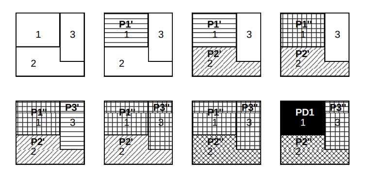
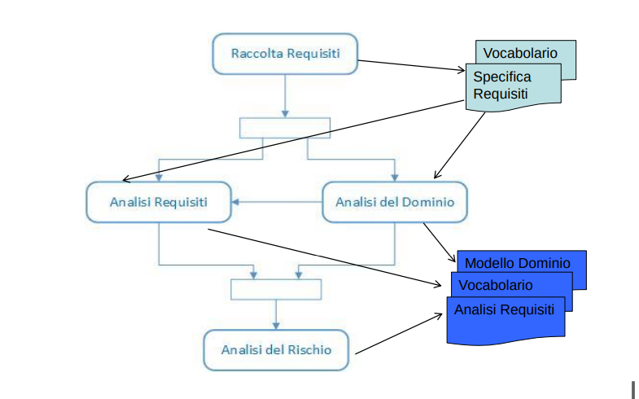

# Riassunto Ingegneria Del Software - Federico Pomponii

- [Riassunto Ingegneria Del Software - Federico Pomponii](#riassunto-ingegneria-del-software---federico-pomponii)
- [DOMANDE ESAME](#domande-esame)
- [Modello - MOD.2](#modello---mod2)
  - [Modelli del sistema](#modelli-del-sistema)
    - [Tracciabilità](#tracciabilit%c3%a0)
  - [Linguaggi di modellazione](#linguaggi-di-modellazione)
    - [Modelli e codice](#modelli-e-codice)
  - [Modelli di processo](#modelli-di-processo)
  - [Modelli di processo di sviluppo](#modelli-di-processo-di-sviluppo)
    - [Modello a cascata](#modello-a-cascata)
      - [Prototipo](#prototipo)
      - [throw-away prorotyping](#throw-away-prorotyping)
    - [Modelli evolutivi](#modelli-evolutivi)
      - [Programmazione esplorativa](#programmazione-esplorativa)
      - [Problemi dei modelli evolutivi](#problemi-dei-modelli-evolutivi)
    - [Modelli ibridi](#modelli-ibridi)
    - [Sviluppo incrementale](#sviluppo-incrementale)
    - [Sviluppo iterativo](#sviluppo-iterativo)
    - [Sviluppo incrementale - iterativo](#sviluppo-incrementale---iterativo)
    - [RUP - Rational Unified Process](#rup---rational-unified-process)
      - [PROSPETTIVA DINAMICA](#prospettiva-dinamica)
      - [PROSPETTIVA STATICA](#prospettiva-statica)
      - [PROSPETTIVA PRATICA](#prospettiva-pratica)
- [ADT - MOD.1-3](#adt---mod1-3)
- [Analisi dei requisiti MOD.2-3](#analisi-dei-requisiti-mod2-3)
  - [Requisiti di sistema](#requisiti-di-sistema)
    - [Requisiti funzionali](#requisiti-funzionali)
    - [Requisiti non funzionali](#requisiti-non-funzionali)
    - [Requisiti di dominio](#requisiti-di-dominio)
  - [Raccolta dei requisiti](#raccolta-dei-requisiti)
  - [Analisi dei requisiti](#analisi-dei-requisiti)
    - [Validazione dei requisiti](#validazione-dei-requisiti)
    - [Cambiamento dei requisiti](#cambiamento-dei-requisiti)
  - [Analisi del dominio](#analisi-del-dominio)
  - [Analisi e gestione dei rischi](#analisi-e-gestione-dei-rischi)
  - [Casi d'uso e scenari](#casi-duso-e-scenari)
    - [Generalizzazione](#generalizzazione)
    - [Inclusione &lt;<include>&gt;](#inclusione-ltincludegt)
    - [Estensione &lt;<extend>&gt;](#estensione-ltextendgt)
- [Diagrammi UML - MOD 2.5](#diagrammi-uml---mod-25)
  - [Rappresentazione di una classe](#rappresentazione-di-una-classe)
  - [Associazioni](#associazioni)
  - [Ereditarietà e Generalizzazione](#ereditariet%c3%a0-e-generalizzazione)
  - [Aggregazione](#aggregazione)
  - [Interfacce e Realizzazioni](#interfacce-e-realizzazioni)
- [Requisiti sicurezza e privacy](#requisiti-sicurezza-e-privacy)
- [VCS - Version Control System](#vcs---version-control-system)
  - [LMU - Lock-Modify-Unlock](#lmu---lock-modify-unlock)
  - [CMM - Copy-Modify-Merge](#cmm---copy-modify-merge)
- [DVCS - Distribuited VCS](#dvcs---distribuited-vcs)
- [Principi sull'architettura dei package](#principi-sullarchitettura-dei-package)
  - [REP - Reuse/Release Equivalent Principle](#rep---reuserelease-equivalent-principle)
  - [CCP - Common Closure Principle](#ccp---common-closure-principle)
  - [CRP - Common Reuse Principle](#crp---common-reuse-principle)
- [Principi di relazione tra packages](#principi-di-relazione-tra-packages)
  - [ACP - Acyclic Dependencies Principle](#acp---acyclic-dependencies-principle)
  - [SDP - Stable Dependencies Principle](#sdp---stable-dependencies-principle)
  - [SAP - Stable Abstractions Principle](#sap---stable-abstractions-principle)
- [MVC](#mvc)
  - [Model](#model)
  - [View](#view)
  - [Controller](#controller)
- [MVP](#mvp)

# DOMANDE ESAME
1 appello
- LMU nei VCS
- Principi sull’architettura dei package 
- UML

2 appello
- Pattern Strategy e Adapter
- Ereditarietà multipla
- UML

3 appello
- MVC e MVP
- CMM nei VCS
- RUP

4 appello
- Pattern Flyweight 
- Passaggio delle variabili ( in-out-in/out )
- UML

# Modello - MOD.2
Per modello si intende una rappresentazione di un oggetto o di un fenomeno reale che riproduce caratteristiche o comportamentei ritenuti fondamentali per il tipo di ricerca che si sta svolgendo.
Per l'Ingegneria del software un modello costituisce un insieme di **concetti** e **proprietà** volti a catturare aspetti **essenziali** di un sistema, collocandosi in un preciso spazio concettuale.
Per l'ingegneria del software un modello costituisce una *visione semplificata* che rende il sistema stesso
- Più acessibile alla comprensione e alla valutazione
- Facilita il trasferimento di informazione e collaborazione tra persone

## Modelli del sistema
Attraverso l'uso di diagrammi si cerca di rappresentare ***modelli del sistema*** per:
-   Descrivere in modo conciso e preciso conoscenze sul problema
-   Individuare rischi e scelte progettuali

I linguaggi per la descrizione dei modelli si basano su livello di astrazione più elevati rispetto ai comuni linguaggi macchina.

### Tracciabilità
In qualsiasi direzione si percorra la sequenza di modelli generati, deve essere possibile mappare uno o più elementi in un modello in uno o più elementi in un altro.

## Linguaggi di modellazione
Un linguaggio di modellazione è un linguaggi ***semi-formale*** che può essere utilizzato per descrivere un sistema di qualche natura.
Quello che si esprime attraverso i diagrammi è una rappresentazione del modello creata attraverso l'uso di un linguaggio (Ad esempio ***UML, OPM o XML*** )

### Modelli e codice
Tipicamente il disallineamento tra modello e codice avviene già durante la fase di implementazione. Alcune modifiche fatte nel codice non vengono *quasi mai* rifless e nei modelli di progettazione del sistema. Viene meno quindi il requisito di tracciabilità.

## Modelli di processo
Un processo di sviluppo è un insieme ordinato di passi fine alla produzione dell'output desiderato a partire dai requisiti in ingresso.
Le generiche fasi sono:
- ***Specifica*** : cosa il sistema dovrebbe fare e vincoli di sviluppo.
- ***Sviluppo*** : produzione del sistema software
- ***Validazione*** : testare che il sistema sviluppato sia quello che il committente voleva.
- ***Evoluzione*** : cambiamenti nel prodotto in accordo a modifiche dei requisiti o incremento delle funzionalità del sistema.

## Modelli di processo di sviluppo
-   Modello a cascata
-   Modelli evolutivi
-   Sviluppo incrementale-Iterativo
-   Modello a spirale
-   Modelli specializzati
    -   Sviluppo a componenti
    -   Modello dei metodi formali
    -   Sviluppo aspect-oriented
    -   Sviluppo model driven
    -   Unified Process (UP - RUP)

### Modello a cascata
Fasi distinte, in cascata tra loro, con retroazione finale.
Il modello si fonda sul presupposto che ogni fase deve essere svolto in maniera esaustiva prima di passare alla successiva. Questo in quanto introdurre cambiamenti al software, in fasi avanzate dello sviluppo, ha costi elevati.
Le uscite che una fase produce come ingresso per la fase successiva sono chiamate ***semilavorati***
I limiti di questo modello sono dati dalla sua *rigidità* in quanto ci sono due assunti di fondo:
-   ***Immutabilità dell'analisi*** - i clienti sono in grado di esprimere esattamente le loro esigenze e, di conseguenza, in fase di analzi iniziale è possibile definire esattamente tutte le funzionalitù che il software deve realizzare.
-   ***Immutabilità del progetto*** - è possibile progettare l'intero sistema prima di aver scritto una sola riga di codice

Per evitare problemi, prima di iniziare a lavorare sul sistema vero e proprio, è meglio realizzare un prototipo

#### Prototipo
Il prototipo ha l'obiettivo di essere mostrato al cliente per ottenere indicazioni sulle specifiche del progetto. Deve essere sviluppabile in tempi brevi e con costi minimi.
   
#### throw-away prorotyping
Prima di iniziare a lavorare sul sistema viene fornito, al cliente, un prototipo su cui definire le specifiche. Una volta esaurito il compito questo prototipo viene abbandonato.

### Modelli evolutivi
Partendo da specifiche molto astratte si sviluppa un primo prototipo da
- Sottoporre al cliente
- raffinare successivamente

#### Programmazione esplorativa
Il prototipo, progressivamente, fluisce nel prodotto feinale.
Questo presuppone un lavoro a stretto contatto con il cliente.

Esistono diversi tipo di modelli evolutivi, ma tutti in sostanza propongono un ciclo di sviluppo in cui un prototipo iniziale evolve, gradualmente, verso il prodotto finito.
Il vantaggio è che ad ogni iterazione è possibile :
- ***Raffinamento dell'analisi*** : rivedere specifiche e funzionalità.
- ***Raffinamento del design*** : rivedere le scelte di progettazione.

#### Problemi dei modelli evolutivi
-   Il processo di sviluppo non è visibile. (Documentazione non disponibile)
-   Il sistema è poco strutturato. (Modifiche frequenti)
-   E' richiesta una particolare abilità nella programmazione. (Team ristretto)

### Modelli ibridi
Si tratta di sistemi composti da sotto-sistemi. Per ogni sotto-sistema è possibile adottare un diverso modello di sviluppo.
- Modello evolutivo -> per sotto-sistemi con specifiche ad alto rischio
- Modello a cascata -> per sotto-sistemi con specifiche ben definite

### Sviluppo incrementale
-   Si costruisce un sistema sviluppandone sistematicamente e in sequenza parti ben definite.
-   **Una volta costruita una parte essa non viene più modificata**

### Sviluppo iterativo
Si effettuano molti passi dell'intero cicli di sviluppo del software, per costruire, iterativamente tutto il sistema.
***Non funziona bene per progetti significativi***

### Sviluppo incrementale - iterativo
- Si individuano sottoparti relativamente autonome
- Si realizza il prototipo di una di esse
- Si continua con altre parti
- Si aumenta, progressivamente, l'estensione e il dettaglio dei protitipi.
  

### RUP - Rational Unified Process
RUP (estensione dello *Unified Process*) è un modello di processo iterativo sviluppato da Rational Software (oggi parte di IBM).
E' un modello ibrido che contiene elementi di tutti i modelli di processo generici.
Non definisce un singolo, specifico processo, bensì un
framework adattabile che può dar luogo a diversi processi
in diversi contesti (per esempio in diverse organizzazioni o
nel contesto di progetti con diverse caratteristiche).
E' pensato per progetti di grandi dimensioni.

RUP individua tre diverse versioni del processo di sviluppo:
-   Una prospettiva dinamica che mostra le fasi del modello nel tempo
-   Una prospettiva statica che mostra le attività del processo coinvolte
-   Una prospettiva pratica che suggerisce le buone prassi da seguire durante il processo

#### PROSPETTIVA DINAMICA
***Inception(Avvio)*** - Generalizzazione dell'analisi di fattibili. Lo scopo principale è quello di delinare nel modo più accurato il business case ovvero:
-   Comprendere il *tipo di mercato* al quale il progetto afferisce e identificare gli elementi importanti affinché esso conduca a un successo commerciale.
-   Identificare tutte le *entità esterne* che interagiranno con il sistema e definire tali interazioni.

***Elaboration(Elaborazione)*** - definisce la struttura complessiva del sistema. Comprende l'analisi di dominio e una prima fase di progettazione dell'architettura. L'elaborazione deve soddisfare i seguenti criteri : 
-   Modello dei casi d'uso completo all'80%
-   Descrizione dell'architettura del sistema
-   Sviluppo di un'architettura esegubile che dimostri il completamento degli use case significativi
-   Revisione del business case e dei rischi
-   Pianificazione del progetto complessivo
  
***Construction(Costruzione)*** - Progettare, programmare e testare il sistema:
-   Le diverse parti del sistema vengono sviluppate parallelamente e poi integrate
-   Al termine della fase si dovrebbe avere un sistema software funzionane e la relativa documentazione pronta

***Transition(Transizione)*** - Il sistema passa dall'ambiente di sviluppo a quello del cliente finale:
-   Vengono condotte attivitù di training degli utenti e beta testing.
-   Si deve in particolare verificare che il prodotto sia conforme alle aspettative descritte nella fase di inception.

#### PROSPETTIVA STATICA
La prospettiva statica di RUP si concentra sulle attività di produzione del software (*** workflow ***).
RUP è stato progettato insieme ad UML quindi, la descrizione dei workflow, è orientata ai modelli UML.
-   **WORKFLOW PRINCIPALI**
    -   ***Modellazione delle attività aziendali***: i processi aziendali sono modellati utilizzando il business case.
    -   ***Requisiti***: vengono identificati gli attori che interagiscono con il sistema e sviluppati i casi d'uso per modellare i requisiti.
    -   ***Analisi e progetto***: viene creato e documentato un modello di progetto.
    -   ***Implementazione***: i componenti del sistema sono implementati e strutturati.
    -   ***Test***
    -   ***Rilascio***: viene creata una release del prodotto.

-   **WORKFLOW DI SUPPORTO**
    -   ***Gestione della configurazione e delle modifiche***: workflow di supporto che gestisce i cambiamenti del sistema.
    -   ***Gestione del progetto***: gestisce lo sviluppo del sistema.
    -   ***Ambiente***: rende disponibili al team di sviluppatori gli strumenti adeguati

#### PROSPETTIVA PRATICA
La prospettiva pratica di RUP descrive la buona prassi che si consiglia di utilizzare nello sviluppo dei sistemi.
Le pratiche fondamentale sono sei:
-   ***Sviluppare il software ciclicamente***: Sviluppare e consegnare le funzioni con la priorità più alta all'inizio del processo di sviluppo.
-   ***Gestire i requisiti***: documentare esplicitamente i requisiti del cliente e i cambiamenti effettuati
-   ***Usare architetture basate sui componenti***: strutturare l'architettura del sistema con approccio a componenti.
-   ***Creare modelli visivi del software***: usare modelli grafici UML
-   ***Verificare la qualità del software***: assicurarsi che il software raggiunga gli standard qualitativi
-   ***Controllare le modifiche del software***: gestire i cambiamenti del software usando un sistema per la gestione delle modifiche.

# ADT - MOD.1-3
Concetti base di classi astratte e programmazione OO

# Analisi dei requisiti MOD.2-3
I requisiti di un sistema rappresentano la descrizione
-   Dei servizi forniti
-   Dei vincoli operativi

-   **Requisiti utente**: dichiarano quali servizi il sistema dovrebbe fornire e i vincoli sotto cui deve operare.
    -   Sono requisiti molto astratti e di alto livello
    -   Tipicamente sono espressi in linguaggio naturale e corredati da qualche diagramma.

-   **Requisiti di sistema**: definiscono le funzioni, i servizi e i vincoli del sistema in modo dettagliato
    -   il ***Documento dei Requisiti del sistema*** deve essere preciso e definire esattamente cosa deve essere sviluppato.

## Requisiti di sistema
I requisiti di sistema, solitamente, sono divisi in:
    -   Requisiti funzionali
    -   Requisiti non funzionali
    -   Requisiti di dominio

### Requisiti funzionali
Descrivono quello che il sistema "dovrebbe fare".
Sono elenchi di servizi che il sistema dovrebbe fornire e per ogni servizio dovrebbe essere indicato:
-   Come reagire a particolari input
-   Come comportarsi in particolari situazioni
-   In alcuni casi specificare cosa il sistema non dovrebbe fare

Le specifiche dei requisiti funzionali dovrebbero essere:
    - **Complete** - Tutti i servizi definiti
    - **Coerenti** - I requisiti non devono avere definizioni contraddittorie

### Requisiti non funzionali
I principali tipi di requisiti non funzionali sono:
- **Requisiti del prodotto**: specificano o limitano le proprietà complessive del sistema.
  -   *affidabilità, prestazioni, protezione dei dati, disponibilità dei servizi,tempi di risposta, occupazione di spazio, capacità dei dispositivi di I/O, rappresentazione dei dati nelle interfacce, etc.* 

- **Requisiti organizzativi**: possono violare anche il processo di sviluppo adottato.
  - *politiche e procedure dell’organizzazione cliente e sviluppatrice,
specifiche degli standard di qualità da adottare, uso di un particolare
CASE tool e linguaggi di implementazione, limiti di budget, requisiti
di consegna e milestones..*

- **Requisiti esterni**: si identificano tutti i requisiti che derivano da fattori non provenienti dal sistema e dal suo processo di sviluppo.
  - ES. Legislazioni sulla privacy dei dati

### Requisiti di dominio
Derivano dal dominio di applicazione del sistema e solitamente si riferiscono ai suoi concetti.
L'analisi deve coinvolgere gli esperti del dominio per chiarire ogni dubbio sulla terminologia.

## Raccolta dei requisiti
-   L'obiettivo è raccogliere tutte le informazioni su cosa il sistema deve fare secondo le intenzioni del cliente. Non prevede passi formali in quano dipende dal particolare tipo di problema
-   **Risultato**
    -   Un documento scritto dall'analista, discusso e approvato dal cliente.
    -   Una versiona iniziale del glossario contente la descrizione *precisa e non ambigua* di tutti i termini e i concetti utilizzati
-   **Tipologia di persone coinvolte**
    -   Analista
    -   Utente
    -   Esperto del dominio (non indispensabile)
-   **Metodi utilizzati**
    -   Interviste, questionari
    -   Studio di doumenti che esprimono i requisiti in forma testuale
    -   Osservazione passiva o attiva del processo da modellare
    -   Studio di sistemi software esistenti
    -   Prototipi

## Analisi dei requisiti

### Validazione dei requisiti
Ogni requisito deve essere validato con i clienti prima di essere inserito nel documento dei requisiti.

### Cambiamento dei requisiti
-   Requisiti esistenti possono essere modificati o rimossi
-   Nuovi requisiti possono essere aggiunti in una qualunque fase del ciclo di sviluppo
-   Il costo del cambiamento è proporzionato all'avanzamento dello sviluppo
-   Ogni cambiamento deve essera accuratamente analizzato

## Analisi del dominio
-   **Obiettivo** definire la porzione del mondo reale, rilevante per il sistema.
-   *Principio Fondamentale* : **Astrazione**
-   **Risultato**: prima versione del *vocabolario* partendo dai sostantivi che si trovano nei requisiti

## Analisi e gestione dei rischi
-   Analisi completa di tutti i possibili rischi che posso fare fallori o intralciare la realizzazione del sistema
-   Ogni rischio presenta due carratteristiche:
    -   Probabilità che avvenga
    -   Costo

Le tipologie di rischi sono:
-   **Rischi relativi ai requisiti**
-   **Rischi relativi alle risorse umane**
-   **Rischi relativi alla protezione e privacy dei dati**
-   **Rischi tecnologici**
-   **Rischi politici**

Strategie risolutive:
-   **Strategia reattiva**
-   **Strategia preventiva**
    -   Si mette in moto prima che inizi il lavoro tecnico
    -   Si individuano rischi potenziali, se ne valutano le probabilità e si stabilisce un ordine di importanza
    -   Si predispone un piano che permetta di reagire in modo controllato ed efficace.

## Casi d'uso e scenari
I casi d'uso e i relativi scenari permettono di:
-   formalizzare i requisiti funzionali
-   di comprendere meglio il funzionamento del sistema
-   di comunicare meglio con il cliente

L'insieme di casi d'uso costituisce l'immagine del sistema con l'esterno.

1. Individuare il confine del sistema
2. Individuare gli attori 
   - Ogni attore modella il ruole interpretato da un utente(*persona o sistema esterno*)
3. Individuare i casi d'uso
4. Disegnare i diagrammi dei casi d'uso
5. Descrivere i dettagli di ogni singolo caso d'uso mediante scenari
6. Ricontrollare e validare i casi d'uso insieme al cliente

Un caso d'uso
- viene sempre avviato, direttamente o indirettamente, dall'intervento di un attore che si pone un obiettivo.
- Si conclude con successo quando l'obiettivo viene raggiunto
- Si conclude con fallimento quando l'obiettivo non viene raggiunto

Un caso d'uso viene sempre descritto dal punto di vista di un attore e comprende
-   **0+ Precondizioni** - Condizioni che devono essere tutte verificate prima che il caso d'uso possa essere eseguito
-   **1+ Scentari - sequenze di passi** - descrivono le interazioni tra l'attore e il sistema
-   **0+ Postcondizioni** - Condizioni che devono essere tutte vere quando il caso d'uso termina l'esecuzione con successo.

Ogni sequenza di passi deve essere scritto in una forma narrativa strutturata e utilizzare il vocabolario di dominio.

Un caso d'uso comprende
-   **1 SCENARIO PRINCIPALE**
-   **0+ SCENARI ALTERNATIVI**

### Generalizzazione
Si utilizza quando un caso d'uso è simile ad un altro, ma fa qualcosa in più

### Inclusione <<include>>
Si utilizza quando un caso d'uso utilizza almeno una volta un altro caso d'uso

### Estensione <<extend>>
Si utilizza quando è necessario aggiungere un comportamento opzionale a un caso d'uso esistente

# Diagrammi UML - MOD 2.5
E' un *linguaggio* che serve per visualizzare, specificare, costruire e documentare un sistema e gli elaborati prodotti durante il suo sviluppo.
## Rappresentazione di una classe
Una classe viene rappresentata in un rettangolo
Un attributo della classe viene indicato separatamente in camelCase (tutto minuscolo se una parola sola) -> *attributo1 : tipo1 = "Valore di default"*.
Le operazioni, sempre separatamente, in camelCase -> *operazione1(**parametri**) : tipoRestituito*

## Associazioni
Un semplice collegamento concettuale da due classi è rappresentato da una linea che li collega.

## Ereditarietà e Generalizzazione
Una classe che eredità da una classe padre è collegata da una freccia (**triangolo vuoto**) con il dalla classe figlia alla classe padre.

## Aggregazione
L'aggregazione è indicata con una freccia (**Triangolo pieno**) dalla classe figlio alla classe intero.

## Interfacce e Realizzazioni
L'interfaccia è definita come una classe, senza attributi, con la dicitura <<*interface*>>.
La relazione classe-interfaccia è definita da una linea tratteggiata con un triangolo aperto che punta all'interfaccia.
# Requisiti sicurezza e privacy
Dal 25/5/2018 vi è l'obbligo di aderenza di un prodotto software, che tratti dati personali, ai principi della GDPR.

** Pseudonimizzazione **:  processo di trattamento dei dati personali in modo tale che i dati non possano più essere attribuiti ad un interessato specifico senza l'utilizzo di informazioni aggiuntive, sempre che tali informazioni
aggiuntive siano conservate separatamente e soggette a misure tecniche e organizzative intese a garantire la non attribuzione a una persona identificata o identificabile.

*"La pseudonimizzazione è una tecnica che consiste nel conservare i dati in una forma che impedisce l’identificazione del soggetto senza l'utilizzo di informazioni aggiuntive."*

# VCS - Version Control System
Nasce dal bisogno di organizzare le versioni del codice. Ogni software ha diverse revisioni per:
-   Diverse piattaforme
-   Versioni del ciclo di sviluppo (alpha, beta, release)
-   Differenti rilasci del prodotto

Version control permette di recuperare vecchie versioni e a più versioni di esistere simultaneamente.
VCS permette di:
-   Avere una cronologia delle modifiche
-   Lavorare contemporaneamente, in parallello, su differenti aspetti del SW
-   Aumentare la produttività

**PROJECTS**
E' l'insieme dei file nel Version Control

**VCS - Repository**
E' dove i file e la cronologia delle modifiche è salvata

**VCS - Working Folder**
E' la copia locale del repository in un determinato stato

**VCS - Branches**
Un branch è una multipla revisione dei file

## LMU - Lock-Modify-Unlock
Più utenti possono modificare lo stesso file e quindi le modifiche potrebbero andare in conflitto.
Per ovviare a questo problema si utilizza il LMU model.
Quindi:
-   Il repository permette ad un file di essere modificato da una sola persona (*Lock* del file)
-   Quando un utente finisce di modificare un file lo sblocca (*Unlock* del file)

Questo modello può creare problemi come ad esempio:
-   Un utente può bloccare un file e dimenticarsi di sbloccarlo
-   Le modifiche su uno stesso file non sempre vanno in conflitto
-   Il lavoro offline

## CMM - Copy-Modify-Merge
-   In questo modello non esiste *Lock* dei file.
-   Ogni volta che un utente fa un check in su una working copy le modifiche vengono *mergiate* nei file del repository

Con questo modello gli utenti possono lavorare comodamente in parallelo. Inoltre, nel caso di conflitti nelle modifiche, il tempo impiegato
nella risoluzione è minore rispetto al tempo impiegato per il *Lock* dei file.

# DVCS - Distribuited VCS
**Trunk**
La linea principale di sviluppo (*Master*)

**Branch**
E' la copia dei file in un determinato istante. Nel momento in cui si crea un nuovo branch vengono generate due copie differenti dei file.
Quando le modifiche sono consolidate è possibile fare la *merge* sul *Trunk*

**Tag**
Il tag sarebbe la release. Solitamente è un tag User-Friendly che indica una specifica revision dei file.

**Pull/Push**

# Principi sull'architettura dei package
## REP - Reuse/Release Equivalent Principle
*The granule of reuse is the granule of release* - Un elemento, sia esso un componente di qualsivoglia tipologia (class, cluster or classes) non
può essere riutilizzato se non è gestisto da un sistema di release di qualche tipo.
I client devono rifiutarsi di utilizzare un componente se l'autore non garantisce la mantenibilità delle vecchie versioni.

## CCP - Common Closure Principle
*Classes that change together, belong together*
L'obiettivo è di minimizzare il numero di *packages* che cambiano in ogni release, in previsione di facilitare il processo di test e deploy per ogni
ciclo di sviluppo del software.
Perciò si cerca di raggruppare insieme le classi che pensiamo cambieranno.

## CRP - Common Reuse Principle
*Classes that aren’t reused together should not be grouped together*
La dipendenza da un package è la dipendenza di tutto quello che appartiene al package. Quindi: le classi che non vengono utilizzate insieme non devono appartenere
allo stesso package.

# Principi di relazione tra packages
## ACP - Acyclic Dependencies Principle
*The dependencies between packages must not form cycles*
Le dipendenze tra package non devono essere cicliche.
Una volta che le modifiche ad un package sono completate gli sviluppatori possono rilasciare le modifiche nel progetto. Una sola dipendenza ciclica potrebbe complicare
questo processo di rilascio del codice.
Quindi bisognerebbe controllare costantemente i packages e risolvere tempestivamente le dipendenze.
Per interrompere un ciclo si può
-   Inserire un package intermedio
-   Inserire un'interfaccia

## SDP - Stable Dependencies Principle
*The dependencies between packages in a design should be in the direction of the stability of the packages.A package should only depend upon packages that are more stable than it is.*

## SAP - Stable Abstractions Principle
*Stable packages should be abstract packages*
La stabilità di un package è richiesto al tempo richiesto per effettuare le modifiche.

# MVC
Permette di suddividere l'applicazione o anche soltanto l'interfaccia dell'applicazione in tre componenti:
-   *Model*
-   *View*
-   *Controller*

## Model
-   Gestisce un insieme di dati logicamente correlati
-   Risponde alle interrogazioni sui dati
-   Risponde alle istruzioni di modifica sullo stato
-   Genera un evento quando lo stato cambia
-   In Java estende la classe *java.util.Observable*

## View
-   Presenta all'utente un insieme di dati ottenuti dal *Model*
-   Si registra presso il *Model* per ricevere eventi del cambiamento dell ostato
-   In Java estende la classe *java.util.Observer*

## Controller
-   Gestisci gli input utente
-   Mappa le azioni
-   Invia comandi al *Model/View*

# MVP
Nella variante Model-View-Presenter la View interagisce con il Presenter piuttosto che con il Model